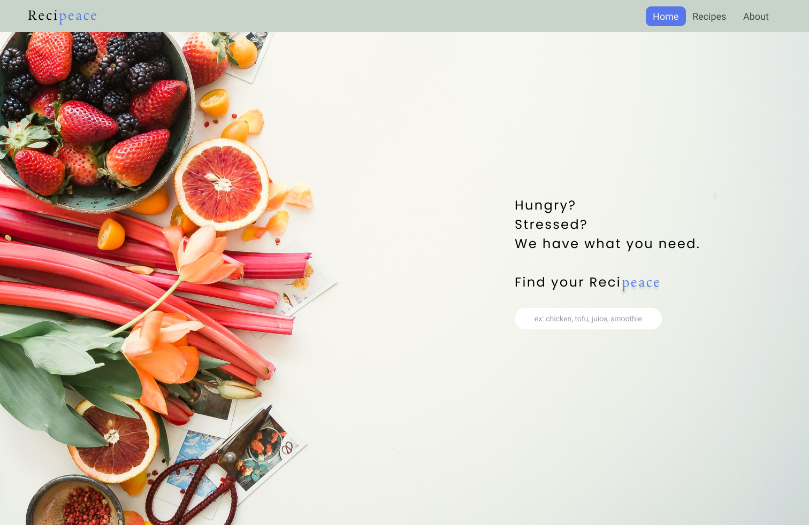
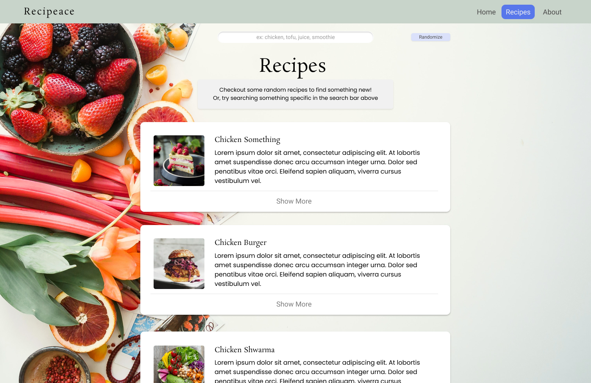
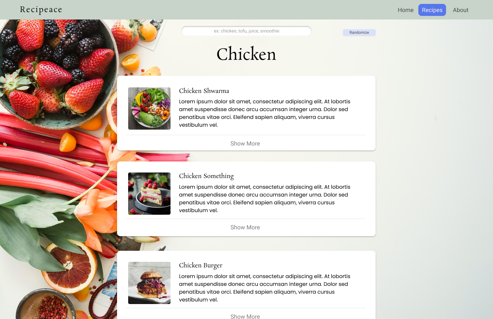
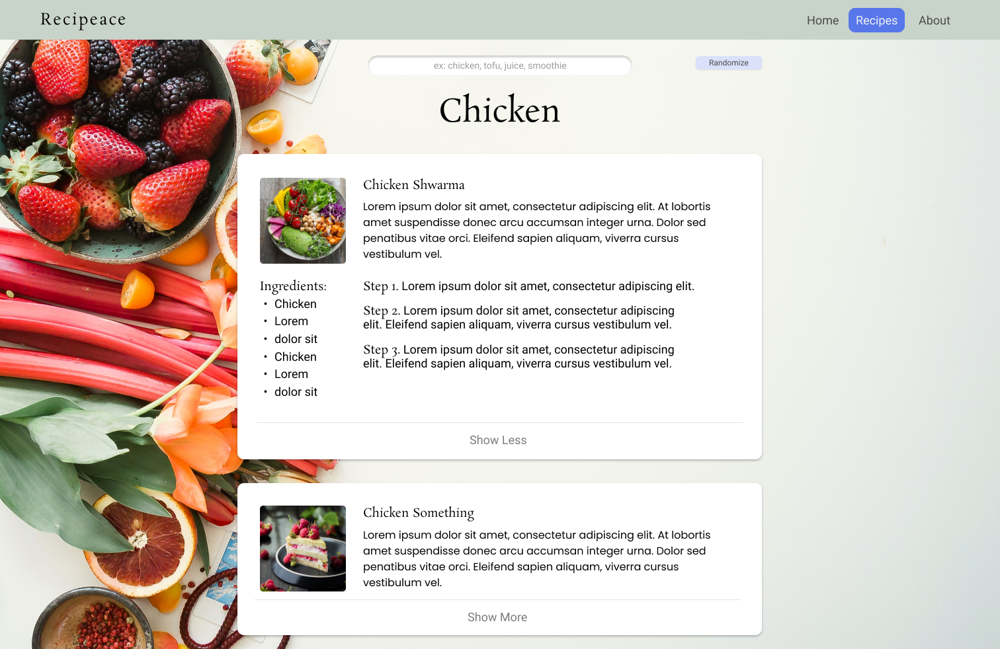
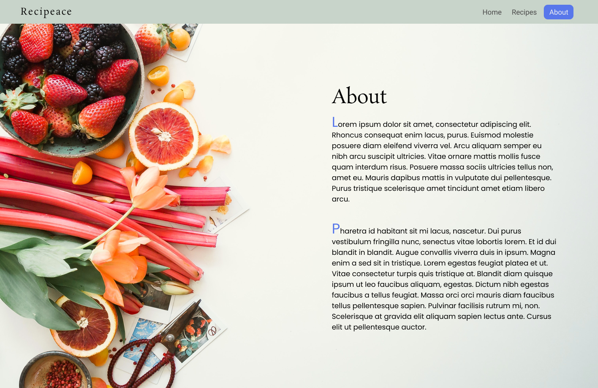

# Recipeace

## Project Description

My app is called Recipeace. It's a single page application that lets hungry users find recipes on anything they are looking for. Users can search for any food item and find detailed recipes on what ingredients are required and cooking instructions.

## Technologies Used

- React
- React-Router-Dom
- JavaScript
- CSS, flexbox, css:selectors

## Installation Instructions

To install this repository:

- If you would like to fork the repository so you have your own copy, feel free to!
- Click on the green "Code" button.
- Copy either the HTTPS or SSH link that is provided (SSH is preferred)
- Open up the Terminal and navigate to the desired directory location
- Once inside, use the code "`git clone` copied_link_here"
- Once the repo has been installed, change into the directory with `cd recipeace`
- From here you can run `code .` to open it up in VS Code

## Planning Process

### User Stories

#### MVP

- As a cook, I want to be able to search for recipes, so that I can find something to cook.
- As a cook, I want to be able to see details about the recipe, so that I can learn about what I'm cooking.
- As a cook, I want to be able to see the ingredients, so I know what goes into the recipe when cooking.
- As a cook, I want to be able to see the steps of the recipes, so I know which order to complete the meal.
- As a user, I want to have a picture of each recipe, so I can see the photo before deciding if I want to cook the meal.

### Wireframes

> Home page when loaded

> Recipe Page (Random)

> Recipe Page (Closed)

> Recipe Page (Open)

> About Page

#### Bronze

- As a user, I would like to have a random recipe, so if I don't know what to cook, I can have a random option to choose from.

#### Silver

#### Gold

## Major Hurdles / Unsolved Problems
