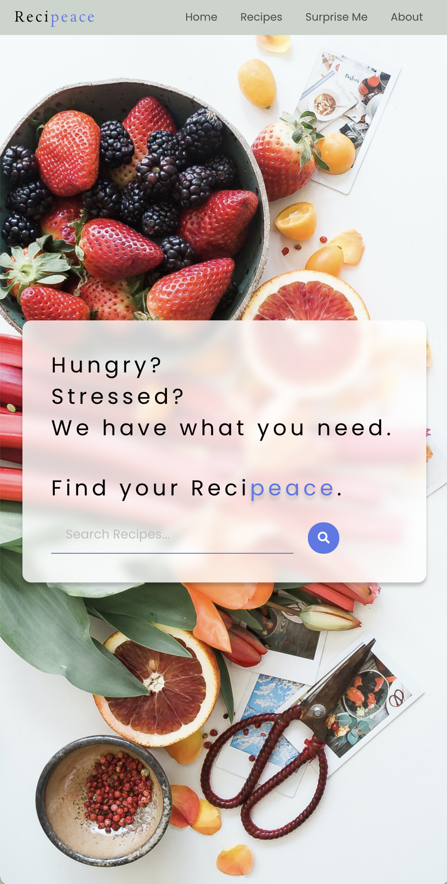
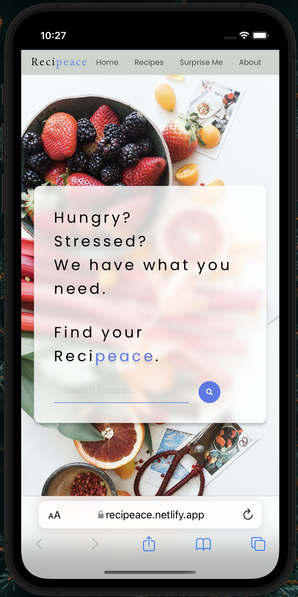
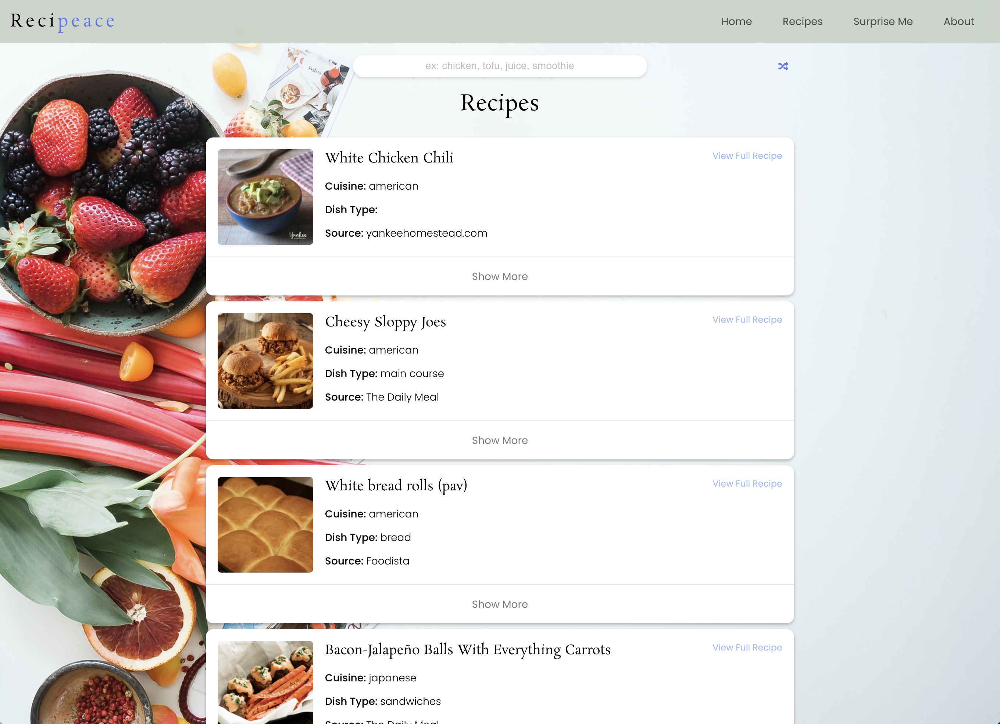
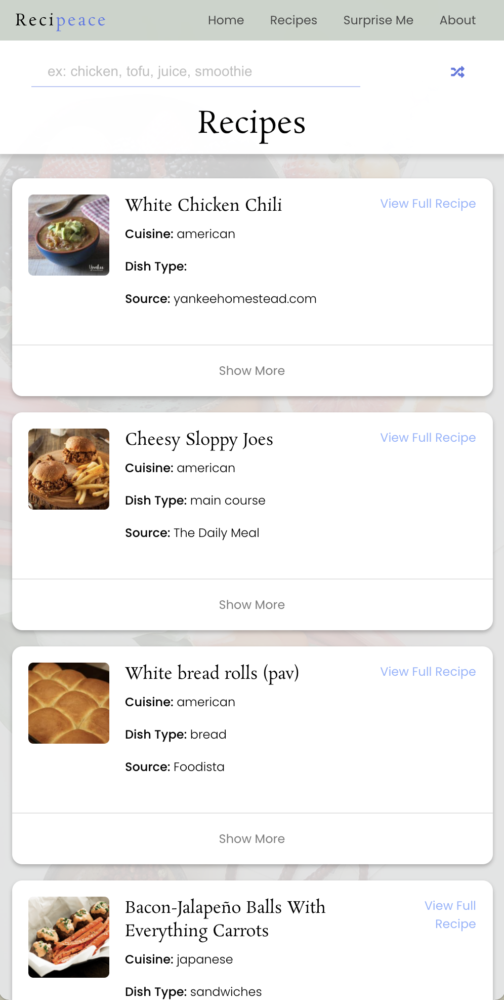

# Recipeace

## Project Description

My app is called Recipeace. It's a single page application that lets hungry users find recipes on anything they are looking for using the Edama API to procure data based on a search query. Users can search for any food related item and find detailed recipes with links to cooking instructions. The Edamam API also pulls in an image for each recipe so you can see what the meal would look like.

## Technologies Used

- React
- React-Router-Dom
- JavaScript
- CSS, flexbox, css:selectors
- HTML
- Font Awesome Icons

## Installation Instructions

To install this repository:

- If you would like to fork the repository so you have your own copy, feel free to!
- Click on the green "Code" button.
- Copy either the HTTPS or SSH link that is provided (SSH is preferred)
- Open up the Terminal and navigate to the desired directory location
- Once inside, use the code "`git clone` copied_link_here"
- Once the repo has been installed, change into the directory with `cd recipeace`
- From here you can run `code .` to open it up in VS Code

## Final Product Images

Home page - Desktop

Home page - Mobile

Recipes page - Desktop

Recipes page - Mobile

## Planning Process

### User Stories

#### MVP

- As a cook, I want to be able to search for recipes, so that I can find something to cook.
- As a cook, I want to be able to see details about the recipe, so that I can learn about what I'm cooking.
- As a cook, I want to be able to see the ingredients, so I know what goes into the recipe when cooking.
- As a user, I want to have a picture of each recipe, so I can see the photo before deciding if I want to cook the meal.

### Wireframes

> Home page when loaded

> Recipe Page (Random)

> Recipe Page (Closed)

> Recipe Page (Open)

> About Page

#### Bronze

- As a user, I would like to have a random recipe button, so if I don't know what to cook, I can have a random option to choose from.

#### Silver

- As a user, I would like to have pagination so I can see more recipes relating to my search.

#### Gold

- As a user, I would like to have an option of seeing recipes based on the time of day.
- As a user, I would like to have the option of seeing recipes based on the weather outside.

## Major Hurdles / Unsolved Problems

> For some recipes, there is no image related to the recipe and this was causing a few problems. I ended up putting a conditional on the image search so it will display a text 'image' in the missing image's place. I found that if you search for `betty's spring`, you will find a recipe with no image to see the example.

- One major hurdle was upon delpoying the site. I had initiated a useEffect for the main input field on the Home page to cycle through a list of food related items. When deployed, Netlify did not agree with the useEffect and none of the components showed up, just a blank .html document with the background image. I ended up removing the useEffect all together in order to make the site functional again.
- Unsolved Problems: Silver and Gold stretch goals. In order to apply those ideas correctly, I would have to redesign the navigation bar to be able to add more options while viewing on mobile. I attempted to incorporate the react-burger-menu library but it would not function the way I wanted it to. So, for now, the stretch goals have been placed on hold for the time being.
